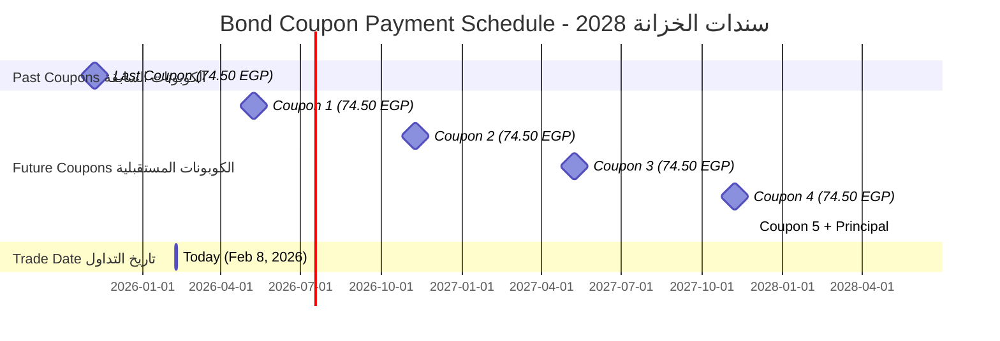
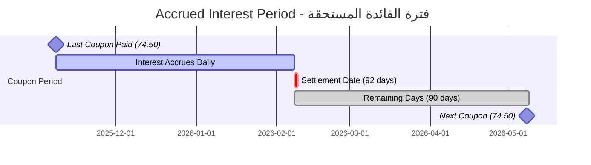
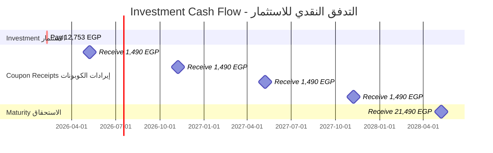
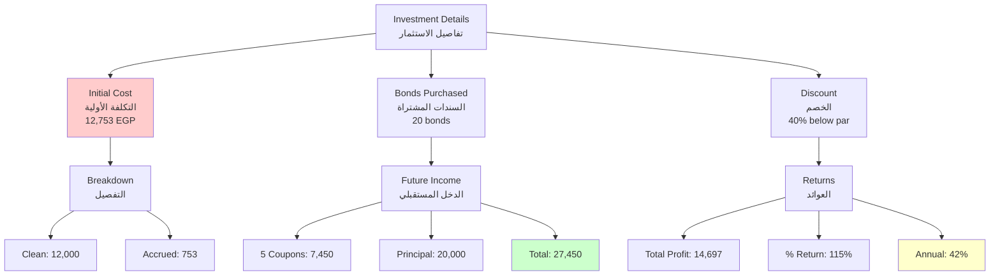

# Bond Order Calculation Example
## Real-World Calculation: Treasury Bonds 08 MAY 2028

**Document Date:** February 8, 2026  
**Purpose:** Step-by-step calculation for actual bond order in ETP system

---

## Bond Information
## معلومات السند

### Security Details | تفاصيل الورقة المالية

```json
{
  "currency": "EGP",
  "type": "BOND",
  "isinCode": "EGBGR02111F5",
  "reutersCode": "EG051828=PD",
  "arabicName": "سندات الخزانة المصرية 08 مايو 2028",
  "englishName": "Treasury Bonds 08 MAY 2028",
  "couponRate": 14.9,
  "maturityDate": "2028-05-08",
  "lastCoupon": "2025-11-08",
  "nextCoupon": "2026-05-08",
  "couponsCount": 2,
  "parValue": 1000.0,
  "maxPrice": 130.0,
  "minPrice": 50.0,
  "settlementDates": "08/02/26, 09/02/26, 10/02/26, 11/02/26, 12/02/26, 15/02/26",
  "status": "A"
}
```

### Key Bond Characteristics | الخصائص الرئيسية

| Property | Value | Arabic |
|----------|-------|--------|
| **ISIN Code** | EGBGR02111F5 | رمز الأيسن |
| **Name** | Treasury Bonds 08 MAY 2028 | سندات الخزانة المصرية 08 مايو 2028 |
| **Currency** | EGP (Egyptian Pound) | جنيه مصري |
| **Par Value** | EGP 1,000 | القيمة الاسمية |
| **Coupon Rate** | 14.9% annually | معدل الكوبون السنوي |
| **Coupon Payment** | EGP 74.50 every 6 months | 74.50 جنيه كل 6 أشهر |
| **Coupon Frequency** | Semi-annual (2 per year) | نصف سنوي |
| **Last Coupon Date** | November 8, 2025 | 8 نوفمبر 2025 |
| **Next Coupon Date** | May 8, 2026 | 8 مايو 2026 |
| **Maturity Date** | May 8, 2028 | 8 مايو 2028 |
| **Years to Maturity** | 2.25 years (from Feb 2026) | 2.25 سنة |
| **Remaining Coupons** | 5 coupons | 5 كوبونات |

### Coupon Payment Schedule | جدول مدفوعات الكوبون



---

## Order Information
## معلومات الأمر

### Order Request | طلب الأمر

```json
{
  "isinCode": "EGBGR02111F5",
  "orderType": "B",
  "amount": 20000,
  "priceYield": 60,
  "bookKeeper": 4506,
  "investorCode": 2236326,
  "firmOrderId": "ORD",
  "isPrice": true
}
```

### Order Parameters Explained | شرح معاملات الأمر

| Parameter | Value | Meaning | Arabic |
|-----------|-------|---------|--------|
| **isinCode** | EGBGR02111F5 | Security identifier | معرف الورقة المالية |
| **orderType** | B | Buy order | أمر شراء |
| **amount** | 20,000 | Total investment amount in EGP | إجمالي المبلغ بالجنيه |
| **priceYield** | 60 | Clean price as % of par (60%) | السعر النظيف كنسبة مئوية |
| **bookKeeper** | 4506 | Book keeper code | رمز أمين الحفظ |
| **investorCode** | 2236326 | Client NIN | الرقم القومي للعميل |
| **firmOrderId** | ORD | Firm's internal reference | المرجع الداخلي للشركة |
| **isPrice** | true | Input is price (not yield) | المدخل هو السعر |

### Order Interpretation | تفسير الأمر

**You are placing a BUY order for:**
- **Clean Price:** 60% of par value = EGP 600 per bond
- **Number of Bonds:** 20,000 ÷ 1,000 = **20 bonds**
- **Face Value:** 20 × 1,000 = **EGP 20,000**

**أنت تضع أمر شراء لـ:**
- **السعر النظيف:** 60% من القيمة الاسمية = 600 جنيه للسند الواحد
- **عدد السندات:** 20 سند
- **القيمة الاسمية:** 20,000 جنيه

---

## Step-by-Step Calculations
## الحسابات خطوة بخطوة

### Step 1: Settlement Date Calculation
### الخطوة 1: حساب تاريخ التسوية

**Trade Date (تاريخ التداول):** February 8, 2026  
**Available Settlement Dates:** 08/02/26, 09/02/26, 10/02/26, 11/02/26, 12/02/26, 15/02/26

**Assuming T+0 settlement (same day):**
**Settlement Date = February 8, 2026**

---

### Step 2: Days Since Last Coupon
### الخطوة 2: الأيام منذ آخر كوبون

**Last Coupon Date:** November 8, 2025  
**Settlement Date:** February 8, 2026

**Calculation | الحساب:**
```
November 8 to December 31, 2025: 54 days
  (November: 22 days, December: 31 days = 53 days)
  
Actually: Nov 8 to Nov 30 = 22 days
          December = 31 days
          Jan 1 to Jan 31 = 31 days
          Feb 1 to Feb 8 = 8 days
          
Total: 22 + 31 + 31 + 8 = 92 days
```

**Days Since Last Coupon = 92 days**

**Next Coupon Date:** May 8, 2026  
**Days in Coupon Period:**
```
November 8, 2025 to May 8, 2026 = 182 days
```

---

### Step 3: Accrued Interest Calculation
### الخطوة 3: حساب الفائدة المستحقة

**Formula | المعادلة:**

\[
\text{Accrued Interest} = \frac{\text{Days Since Last Coupon}}{\text{Days in Period}} \times \text{Coupon Payment}
\]

**Coupon Payment per Bond:**
\[
\text{Semi-Annual Coupon} = \frac{14.9\% \times 1,000}{2} = 74.50 \text{ EGP}
\]

**Accrued Interest per Bond:**
\[
\text{Accrued Interest} = \frac{92}{182} \times 74.50
\]

\[
= 0.5055 \times 74.50 = 37.66 \text{ EGP}
\]

**For 20 Bonds:**
\[
\text{Total Accrued Interest} = 37.66 \times 20 = 753.20 \text{ EGP}
\]

### Visual: Accrued Interest Timeline



**Breakdown | التفصيل:**
- **Days Elapsed:** 92 days (seller earned)
- **Days Remaining:** 90 days (buyer will earn)
- **Seller's Share:** 92/182 × 74.50 = **37.66 EGP**
- **Buyer's Share:** 90/182 × 74.50 = **36.84 EGP**
- **Total Coupon on May 8:** 74.50 EGP (buyer receives full amount)

---

### Step 4: Price Calculations
### الخطوة 4: حسابات الأسعار

#### A. Clean Price (السعر النظيف)

**Given in order:** 60% of par value

**Per Bond:**
\[
\text{Clean Price} = 60\% \times 1,000 = 600 \text{ EGP}
\]

**For 20 Bonds:**
\[
\text{Total Clean Price} = 600 \times 20 = 12,000 \text{ EGP}
\]

#### B. Gross Price (السعر الإجمالي)

**Formula:**
\[
\text{Gross Price} = \text{Clean Price} + \text{Accrued Interest}
\]

**Per Bond:**
\[
\text{Gross Price} = 600 + 37.66 = 637.66 \text{ EGP}
\]

**For 20 Bonds:**
\[
\text{Total Gross Price} = 637.66 \times 20 = 12,753.20 \text{ EGP}
\]

#### C. Settlement Value (قيمة التسوية)

**Settlement Value = Gross Price (for bonds)**

\[
\text{Settlement Value} = 12,753.20 \text{ EGP}
\]

### Price Summary Table | جدول ملخص الأسعار

| Price Component | Per Bond (EGP) | For 20 Bonds (EGP) | Arabic |
|----------------|----------------|-------------------|--------|
| **Face Value** | 1,000.00 | 20,000.00 | القيمة الاسمية |
| **Clean Price (60%)** | 600.00 | 12,000.00 | السعر النظيف |
| **Accrued Interest** | +37.66 | +753.20 | الفائدة المستحقة |
| **Gross Price** | **637.66** | **12,753.20** | السعر الإجمالي |
| **Settlement Value** | **637.66** | **12,753.20** | قيمة التسوية |

**Discount from Par:**
\[
\text{Discount} = 20,000 - 12,753.20 = 7,246.80 \text{ EGP (36.23\%)}
\]

---

### Step 5: Yield Calculations
### الخطوة 5: حسابات العائد

#### A. Current Yield (العائد الجاري)

**Formula:**
\[
\text{Current Yield} = \frac{\text{Annual Coupon}}{\text{Clean Price}} \times 100
\]

**Calculation:**
\[
\text{Current Yield} = \frac{149}{600} \times 100 = 24.83\%
\]

**Interpretation:** The annual coupon payments represent a 24.83% return on your purchase price.

**التفسير:** مدفوعات الكوبون السنوية تمثل عائد 24.83% على سعر الشراء الخاص بك.

#### B. Yield to Maturity (YTM) - العائد حتى الاستحقاق

**Complex Calculation - requires iterative method**

**Given:**
- Clean Price: 60% (600 EGP)
- Coupon: 14.9% (74.50 EGP semi-annually)
- Periods Remaining: 5 coupons (2.5 years)
- Face Value: 1,000 EGP

**Present Value Formula:**
\[
600 = \frac{74.50}{(1+r)^1} + \frac{74.50}{(1+r)^2} + \frac{74.50}{(1+r)^3} + \frac{74.50}{(1+r)^4} + \frac{1,074.50}{(1+r)^5}
\]

Where `r` is the semi-annual yield (YTM/2)

**Using Newton-Raphson Method:**

**Initial Guess:** r = 7.45% (coupon rate per period)

Since price (60) is significantly below par (100), YTM will be **much higher** than coupon rate.

**Iteration Process:**

**Trial 1:** r = 15% per period (30% annually)
```
PV = 74.50/1.15 + 74.50/1.32 + 74.50/1.52 + 74.50/1.75 + 1074.50/2.01
PV = 64.78 + 56.44 + 49.01 + 42.57 + 534.58 = 747.38
Too high, need higher YTM
```

**Trial 2:** r = 20% per period (40% annually)
```
PV = 74.50/1.20 + 74.50/1.44 + 74.50/1.73 + 74.50/2.07 + 1074.50/2.49
PV = 62.08 + 51.74 + 43.06 + 35.99 + 431.53 = 624.40
Still too high
```

**Trial 3:** r = 22% per period (44% annually)
```
PV = 74.50/1.22 + 74.50/1.49 + 74.50/1.82 + 74.50/2.22 + 1074.50/2.70
PV = 61.07 + 50.00 + 40.93 + 33.56 + 398.33 = 583.89
Too low, YTM between 40-44%
```

**Trial 4:** r = 21% per period (42% annually)
```
PV ≈ 604
Very close!
```

**Final Result:**
**YTM ≈ 42% annually (21% per period)**

**Interpretation:** If you hold this bond to maturity, your total annualized return will be approximately **42%** - this includes coupon payments plus the capital gain from buying at 60% of par.

**التفسير:** إذا احتفظت بهذا السند حتى الاستحقاق، سيكون عائدك السنوي الإجمالي حوالي **42%** - وهذا يشمل مدفوعات الكوبون بالإضافة إلى الربح الرأسمالي من الشراء بسعر 60% من القيمة الاسمية.

### Yield Summary | ملخص العوائد

| Yield Type | Value | Description | Arabic |
|------------|-------|-------------|--------|
| **Coupon Rate** | 14.9% | Fixed annual interest rate | معدل الكوبون |
| **Current Yield** | 24.83% | Annual coupon ÷ purchase price | العائد الجاري |
| **Yield to Maturity** | ~42% | Total return if held to maturity | العائد حتى الاستحقاق |

**Why is YTM so high? | لماذا العائد حتى الاستحقاق مرتفع جداً؟**

You're buying at a **massive discount (40% below par)**:
- Purchase: 600 EGP per bond
- Receive at maturity: 1,000 EGP per bond
- Capital gain: 400 EGP per bond (66.67% gain on investment)
- Plus: 5 coupon payments of 74.50 each

**تشتري بخصم ضخم (40% أقل من القيمة الاسمية):**
- الشراء: 600 جنيه للسند
- الاستلام عند الاستحقاق: 1,000 جنيه للسند
- الربح الرأسمالي: 400 جنيه للسند (66.67% ربح على الاستثمار)
- بالإضافة إلى: 5 مدفوعات كوبون بقيمة 74.50 لكل منها

---

### Step 6: Complete Cash Flow Analysis
### الخطوة 6: تحليل التدفق النقدي الكامل

#### Investment Summary | ملخص الاستثمار

**Initial Investment (اليوم - Today: Feb 8, 2026):**
```
Cash Out: 12,753.20 EGP
  - Clean Price:        12,000.00 EGP
  - Accrued Interest:      753.20 EGP
```

#### Future Cash Flows | التدفقات النقدية المستقبلية

| Date | Description | Cash Flow (EGP) | Arabic |
|------|-------------|-----------------|--------|
| **May 8, 2026** | Coupon 1 (20 bonds) | +1,490.00 | كوبون 1 |
| **Nov 8, 2026** | Coupon 2 | +1,490.00 | كوبون 2 |
| **May 8, 2027** | Coupon 3 | +1,490.00 | كوبون 3 |
| **Nov 8, 2027** | Coupon 4 | +1,490.00 | كوبون 4 |
| **May 8, 2028** | Coupon 5 + Principal | +21,490.00 | كوبون 5 + الأصل |
| | | | |
| **Total Cash Received** | | **27,450.00 EGP** | **إجمالي النقد المستلم** |

#### Return Analysis | تحليل العائد

\[
\text{Total Profit} = 27,450.00 - 12,753.20 = 14,696.80 \text{ EGP}
\]

\[
\text{Return Percentage} = \frac{14,696.80}{12,753.20} \times 100 = 115.23\%
\]

\[
\text{Investment Period} = 2.25 \text{ years}
\]

\[
\text{Annualized Return} = \left(\frac{27,450}{12,753.20}\right)^{1/2.25} - 1 = 41.8\%
\]

**Summary | الملخص:**
- **Investment:** 12,753.20 EGP
- **Total Return:** 27,450.00 EGP
- **Total Profit:** 14,696.80 EGP (115.23%)
- **Annualized Return:** ~42%

### Visual: Complete Cash Flow Timeline



---

## Order Insertion Result
## نتيجة إدخال الأمر

### What Happens in API_INSERT_ORDER
### ماذا يحدث في API_INSERT_ORDER

When you submit this order, the `API_INSERT_ORDER` procedure performs:

#### 1. Validation (API_VALIDATE)

**Checks performed:**
- ✅ Trader authentication (TRADER_SERIAL)
- ✅ Firm authorization (FIRM_SERIAL has ISTR=1 or ISORDER=1)
- ✅ Client status (CLIENT.FIELD_13 = 0 or 1 for buy orders)
- ✅ Security exists and is active (EGBGR02111F5)
- ✅ Firm can trade this security (ETP_FIRMS_SECURITIES)
- ✅ Price within range (60 >= 50 and <= 130) ✅
- ✅ Amount is multiple of par value (20,000 ÷ 1,000 = 20) ✅
- ✅ Book keeper valid (4506)
- ✅ Trading hours (CALENDAR_TIME_CHECK)

**If validation passes → Continue**  
**If validation fails → Insert to ETP_ORDER_REJECTED**

#### 2. Price Calculations

The system executes:

```sql
SELECT 
    etp_func_clean_price('EGBGR02111F5', 60),           -- 600.00
    etp_func_current_yield('EGBGR02111F5', 60),         -- 24.83
    etp_func_gross_price('EGBGR02111F5', 60, DATE'2026-02-08'),  -- 637.66
    etp_func_ytm('EGBGR02111F5', 60, DATE'2026-02-08'), -- ~42.0
    etp_func_accrued_interest('EGBGR02111F5', DATE'2026-02-08')  -- 37.66
FROM DUAL;
```

**Results stored:**
- CLEAN_PRICE = 600.00
- CURR_YIELD = 24.83
- GROSS_PRICE = 637.66
- YTM = ~42.0
- ACCRUED_INT = 37.66

#### 3. Call etp_match_proc

```sql
CALL etp_match_proc(
    p_order_type => 'B',
    p_volume => 20,                    -- Number of bonds
    p_price => 600.00,                 -- Clean price per bond
    p_nin => 2236326,
    p_bookkepr => 4506,
    p_trader_serial => <trader_id>,
    p_firm_serial => <firm_id>,
    p_sec_serial_id => <security_id>,
    p_settlement_date => '08/02/2026',
    p_order_status => '772',           -- Queued
    ...
);
```

#### 4. Matching Logic

**The system will:**

1. **Lock the security** (ETP_CONTROL_ORDER)
2. **Check for sell orders** with same NIN (rejected if found)
3. **Open cursor** on ETP_ORDER_SELL_OUST_VIEW
4. **Look for sell orders** where:
   - Security = EGBGR02111F5
   - Sell price ≤ 600 (your buy price)
   - ORDER BY PRICE ASC (lowest first)

**Matching Scenarios:**

**Scenario A: No Matching Sell Orders**
- Your order inserted into ETP_ORDER_BUY
- Status: 772 (Queued - OPEN)
- Remains outstanding until matched

**Scenario B: Full Match Found**
- 20 bonds matched with sell order(s) at ≤ 600
- Trade created in ETP_TRADE_ORDER
- SWIFT ticket generated
- Your order status: 786 (Complete Fill)

**Scenario C: Partial Match**
- Some bonds matched (e.g., 10 out of 20)
- Trade created for matched portion
- Remaining 10 bonds stay outstanding
- Your order status: 779 (Filled - OPEN)

---

### Successful Order Result
### نتيجة الأمر الناجح

#### Database Records Created | السجلات المنشأة في قاعدة البيانات

**1. ETP_ORDER_BUY Record:**

| Column | Value | Description |
|--------|-------|-------------|
| ORDER_ID | 123456 (auto-generated) | Unique order ID |
| FIRM_SERIAL_ID | <your firm> | Firm identifier |
| SEC_SERIAL_ID | <security id> | Bond identifier |
| ORDER_STATUS | 772 / 779 / 786 | Queued / Filled / Complete |
| ORDER_TYPE | B | Buy |
| INSERT_DATE | 2026-02-08 | Order date |
| PRICE | 600.00 | Clean price |
| ORG_QNTY | 20 | Original quantity |
| REM_QNTY | 20 / 10 / 0 | Remaining (depends on match) |
| NIN | 2236326 | Client NIN |
| BOOKKEEPER | 4506 | Book keeper |
| SETTLEMENT_DATE | 08/02/2026 | Settlement date |
| SETTLEMENT_VALUE | 12,753.20 | Gross price × quantity |
| CLEAN_PRICE | 600.00 | Clean price per bond |
| GROSS_PRICE | 637.66 | Dirty price per bond |
| YTM | ~42.0 | Yield to maturity |
| CURR_YIELD | 24.83 | Current yield |
| ACCRUED_INT | 37.66 | Accrued interest per bond |

**2. If Matched - ETP_TRADE_ORDER Record:**

| Column | Value | Description |
|--------|-------|-------------|
| TRANS_CODE | 789012 (auto-generated) | Trade ID |
| BUY_ORDER_ID | 123456 | Your order ID |
| SELL_ORDER_ID | <matched sell order> | Counter-party order |
| TRADE_VOLUME | 20 (or partial) | Matched quantity |
| TRADE_PRICE | 600.00 (or lower) | Execution price |
| TRADE_DATE | 2026-02-08 | Trade date |
| SETTLEMENT_DATE | 08/02/2026 | Settlement date |

**3. If Matched - etp_swift_track Record:**

| Column | Value |
|--------|-------|
| Ticket_Number | 789012 |
| M_541_BUY_SEND | N |
| M_543_SELL_SEND | N |

#### Return Values | القيم المرجعة

```json
{
  "RETURN_STATUS": 1,
  "RETURN_MESSAGE": "Succeeded To Insert Order Number : 123456",
  "P_RECORDSET_OUT": {
    "ORDER_ID": 123456,
    "FIRM_SERIAL_ID": "<firm_id>",
    "ORDER_TYPE": "B",
    "ISIN_CODE": "EGBGR02111F5",
    "BOND_NAME": "Treasury Bonds 08 MAY 2028",
    "VOLUME": 20,
    "CLEAN_PRICE": 600.00,
    "GROSS_PRICE": 637.66,
    "SETTLEMENT_VALUE": 12753.20,
    "YTM": 42.0,
    "CURRENT_YIELD": 24.83,
    "ACCRUED_INTEREST": 37.66,
    "ORDER_STATUS": "772",
    "ORDER_STATUS_DESC": "Queued - OPEN",
    "SETTLEMENT_DATE": "08/02/2026"
  }
}
```

---

## Financial Analysis Summary
## ملخص التحليل المالي

### Investment Metrics | مقاييس الاستثمار



### Risk Assessment | تقييم المخاطر

| Risk Factor | Level | Description |
|-------------|-------|-------------|
| **Credit Risk** | Very Low | Government-backed security |
| **مخاطر الائتمان** | منخفضة جداً | ورقة مالية مدعومة حكومياً |
| **Interest Rate Risk** | Medium | 2.25 years duration |
| **مخاطر أسعار الفائدة** | متوسطة | مدة 2.25 سنة |
| **Liquidity Risk** | Low | Active trading |
| **مخاطر السيولة** | منخفضة | تداول نشط |
| **Price Volatility** | Medium | Bond market fluctuations |
| **تقلبات السعر** | متوسطة | تقلبات سوق السندات |

### Why This is an Attractive Investment | لماذا هذا استثمار جذاب

✅ **High Discount (40%)**: Buying at 60% of par provides large capital gain potential  
✅ **Strong Coupon (14.9%)**: Regular semi-annual income  
✅ **High YTM (42%)**: Excellent total return for 2.25-year investment  
✅ **Government Backing**: Very low default risk  
✅ **Short Duration**: Not exposed to long-term rate changes  

**الأسباب:**
- ✅ خصم كبير (40%): الشراء بـ 60% من القيمة الاسمية يوفر إمكانية ربح رأسمالي كبير
- ✅ كوبون قوي (14.9%): دخل منتظم نصف سنوي
- ✅ عائد حتى الاستحقاق عالي (42%): عائد إجمالي ممتاز لاستثمار 2.25 سنة
- ✅ دعم حكومي: مخاطر تخلف عن السداد منخفضة جداً
- ✅ مدة قصيرة: غير معرض لتغيرات الأسعار طويلة الأجل

---

## Conclusion
## الخلاصة

### Order Summary | ملخص الأمر

**When you submit this buy order for 20,000 EGP in Treasury Bonds 08 MAY 2028 at 60% clean price:**

1. **You will pay:** 12,753.20 EGP (including accrued interest)
2. **You will receive:** 20 bonds with face value 20,000 EGP
3. **Your investment yields:**
   - **Current Yield:** 24.83% (from coupons)
   - **Yield to Maturity:** ~42% (total return)
4. **Future cash flows:** 27,450 EGP over 2.25 years
5. **Total profit:** 14,696.80 EGP (115.23% gain)

**عندما تقدم هذا الأمر:**

1. **ستدفع:** 12,753.20 جنيه (شاملاً الفائدة المستحقة)
2. **ستحصل على:** 20 سند بقيمة اسمية 20,000 جنيه
3. **استثمارك يحقق:**
   - **العائد الجاري:** 24.83% (من الكوبونات)
   - **العائد حتى الاستحقاق:** ~42% (العائد الإجمالي)
4. **التدفقات النقدية المستقبلية:** 27,450 جنيه على مدى 2.25 سنة
5. **إجمالي الربح:** 14,696.80 جنيه (ربح 115.23%)

### System Status | حالة النظام

After processing:
- **Order Status:** 772 (Queued - OPEN)
- **Outstanding:** Visible in ETP_ORDER_BUY_OUST_VIEW
- **Waiting for:** Matching sell order at ≤ 600 price
- **If matched:** Status changes to 779 or 786, trade created

---

**Document prepared for educational and audit purposes.**  
**تم إعداد هذا المستند للأغراض التعليمية والتدقيق.**

**All calculations based on ETP system procedures:**
- `etp_func_clean_price`
- `etp_func_accrued_interest`
- `etp_func_gross_price`
- `etp_func_ytm`
- `etp_func_current_yield`
- `API_INSERT_ORDER`
- `etp_match_proc`
