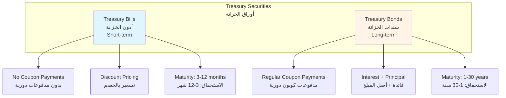
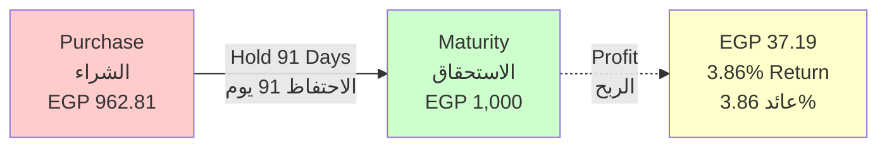
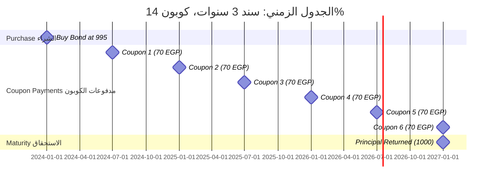
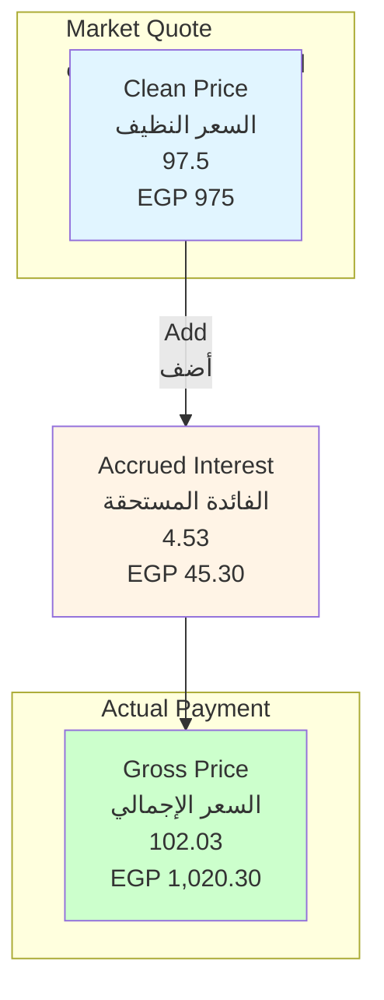
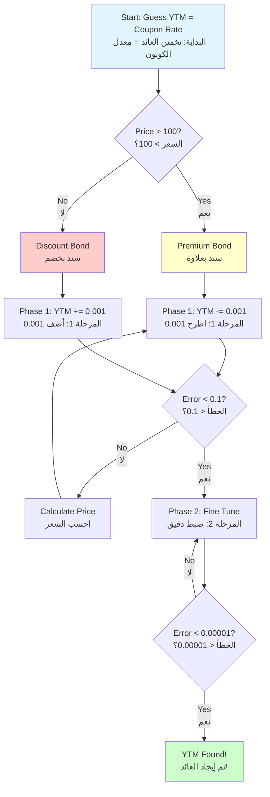
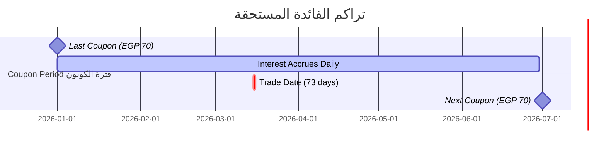
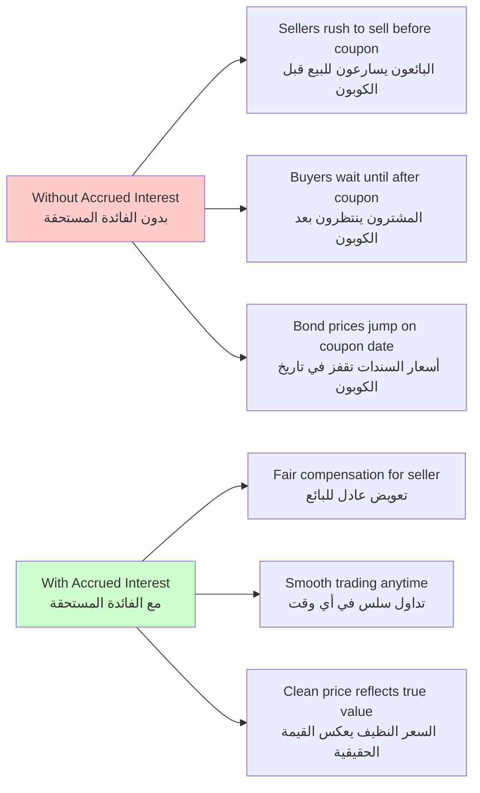
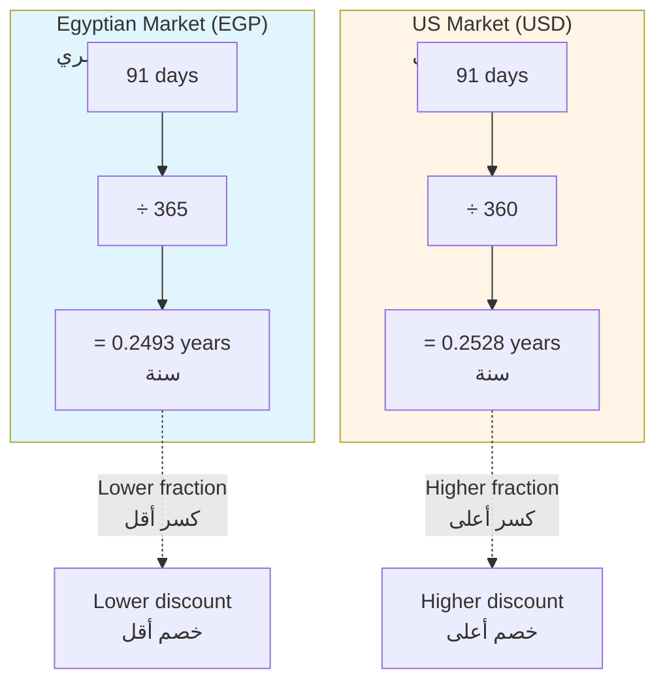
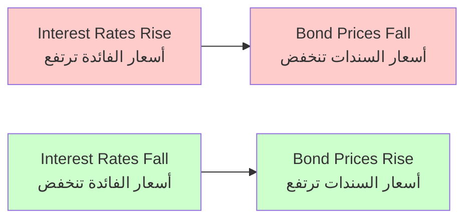

# Financial Concepts Guide
## Egyptian Treasury Trading System (ETP)

**دليل المفاهيم المالية - نظام تداول أذون وسندات الخزانة المصرية**

**Document Version:** 1.0  
**Date:** February 4, 2026  
**Purpose:** Educational reference for financial calculations in bond and bill trading

---

## Table of Contents

1. [Treasury Securities Overview](#treasury-securities-overview)
2. [T-Bills (أذون الخزانة)](#t-bills-أذون-الخزانة)
3. [T-Bonds (سندات الخزانة)](#t-bonds-سندات-الخزانة)
4. [Price Concepts](#price-concepts)
5. [Yield Concepts](#yield-concepts)
6. [Accrued Interest](#accrued-interest)
7. [Day Count Conventions](#day-count-conventions)
8. [Complete Worked Examples](#complete-worked-examples)

---

## Treasury Securities Overview
## نظرة عامة على أوراق الخزانة

### What are Treasury Securities?
**ما هي أوراق الخزانة؟**

Treasury securities are debt instruments issued by the government to finance its operations. Investors lend money to the government and receive interest in return.

**أوراق الخزانة هي أدوات دين تصدرها الحكومة لتمويل عملياتها. يقوم المستثمرون بإقراض المال للحكومة ويحصلون على فائدة في المقابل.**

### Types Comparison
### مقارنة الأنواع



---

## T-Bills (أذون الخزانة)
## Treasury Bills - Short Term Debt Instruments

### Definition | التعريف

**English:** Short-term government debt securities with maturities of less than one year. They do not pay regular interest but are sold at a discount to face value.

**العربية:** أوراق مالية حكومية قصيرة الأجل تستحق في أقل من سنة. لا تدفع فائدة دورية ولكن تُباع بخصم من القيمة الاسمية.

### Key Characteristics | الخصائص الرئيسية

| Feature | English | العربية |
|---------|---------|---------|
| **Maturity** | 91, 182, 273, or 364 days | 91، 182، 273، أو 364 يوم |
| **Interest** | Zero coupon (discount instrument) | بدون كوبون (أداة خصم) |
| **Face Value** | EGP 1,000 (par value) | 1000 جنيه مصري (القيمة الاسمية) |
| **Purchase** | Bought at discount | تُشترى بخصم |
| **Return** | Redeemed at full face value | تُستَرد بالقيمة الاسمية الكاملة |
| **Risk** | Very low (government backed) | منخفض جداً (مدعوم حكومياً) |

### T-Bill Pricing Formula | معادلة تسعير أذون الخزانة

**The Discount Price Formula:**

```
Price = Face Value / (1 + (Yield × Days to Maturity / Day Count Basis))
```

**In Arabic:**
```
السعر = القيمة الاسمية / (1 + (العائد × أيام حتى الاستحقاق / أساس حساب الأيام))
```

**Formula in ETP System:**
```sql
FUNCTION etp_func_bill_price (
    P_yield NUMBER,              -- Yield as percentage (e.g., 15.5 for 15.5%)
    P_Days_to_Maturity NUMBER,   -- Days until maturity
    p_DayCount NUMBER DEFAULT 365 -- 365 for EGP, 360 for USD/EUR
) RETURN NUMBER AS
BEGIN
    RETURN ROUND(1 / (((P_yield/100) * P_Days_to_Maturity / p_DayCount) + 1), 5);
END;
```

### Example 1: Egyptian Treasury Bill (EGP)
### مثال 1: أذون خزانة مصرية

**Given Data | البيانات المعطاة:**
- Face Value (القيمة الاسمية) = EGP 1,000
- Yield (العائد) = 15.5%
- Days to Maturity (أيام حتى الاستحقاق) = 91 days
- Day Count Basis (أساس الحساب) = 365 days (Egyptian standard)

**Calculation | الحساب:**

\[
\text{Price} = \frac{1}{1 + \left(\frac{15.5}{100} \times \frac{91}{365}\right)}
\]

\[
\text{Price} = \frac{1}{1 + (0.155 \times 0.249315)}
\]

\[
\text{Price} = \frac{1}{1 + 0.038644}
\]

\[
\text{Price} = \frac{1}{1.038644} = 0.96281
\]

**Per EGP 1,000:**
\[
\text{Purchase Price} = 1,000 \times 0.96281 = \text{EGP } 962.81
\]

**Investor Profit | ربح المستثمر:**
\[
\text{Profit} = 1,000 - 962.81 = \text{EGP } 37.19
\]

**Return on Investment:**
\[
\text{ROI} = \frac{37.19}{962.81} \times 100 = 3.86\%
\]

### Example 2: T-Bill in USD
### مثال 2: أذون خزانة بالدولار

**Given Data:**
- Face Value = USD 1,000
- Yield = 5.25%
- Days to Maturity = 182 days
- Day Count Basis = 360 days (USD standard)

**Calculation:**

\[
\text{Price} = \frac{1}{1 + \left(\frac{5.25}{100} \times \frac{182}{360}\right)}
\]

\[
\text{Price} = \frac{1}{1 + (0.0525 \times 0.505556)}
\]

\[
\text{Price} = \frac{1}{1.026542} = 0.97414
\]

**Purchase Price = USD 974.14**

### Visual: T-Bill Cash Flow
### الرسم التوضيحي: التدفق النقدي لأذون الخزانة



**Key Points | النقاط الرئيسية:**
- ✅ No periodic interest payments | لا توجد مدفوعات فائدة دورية
- ✅ Single payment at maturity | دفعة واحدة عند الاستحقاق
- ✅ Lower risk, lower return | مخاطرة أقل، عائد أقل
- ✅ Ideal for short-term cash parking | مثالي لوقوف الأموال قصيرة الأجل

---

## T-Bonds (سندات الخزانة)
## Treasury Bonds - Long Term Debt Instruments

### Definition | التعريف

**English:** Long-term government debt securities with maturities of one year or more. They pay fixed interest (coupon) every six months and return principal at maturity.

**العربية:** أوراق مالية حكومية طويلة الأجل تستحق في سنة أو أكثر. تدفع فائدة ثابتة (كوبون) كل ستة أشهر وترد الأصل عند الاستحقاق.

### Key Characteristics | الخصائص الرئيسية

| Feature | English | العربية |
|---------|---------|---------|
| **Maturity** | 1 to 30 years | من سنة إلى 30 سنة |
| **Coupon** | Fixed semi-annual payments | مدفوعات نصف سنوية ثابتة |
| **Face Value** | EGP 1,000 (par value) | 1000 جنيه مصري (القيمة الاسمية) |
| **Interest** | Paid every 6 months | تُدفع كل 6 أشهر |
| **Price** | Can trade above or below par | يمكن أن تتداول أعلى أو أقل من القيمة الاسمية |
| **Risk** | Low (government backed) | منخفض (مدعوم حكومياً) |

### Bond Cash Flow Timeline
### الجدول الزمني للتدفقات النقدية للسندات



**Total Cash Received | إجمالي النقد المستلم:**
- Coupon Payments: 6 × EGP 70 = EGP 420
- Principal Return: EGP 1,000
- **Total: EGP 1,420**

**Investment:**
- Purchase Price: EGP 995

**Net Profit | صافي الربح:**
- EGP 1,420 - EGP 995 = **EGP 425**

---

## Price Concepts
## مفاهيم الأسعار

### 1. Clean Price (السعر النظيف)

**Definition:**
The quoted price of a bond that **excludes accrued interest**. This is the price used for trading and displayed in the market.

**التعريف:**
سعر السند المُعلن والذي **لا يشمل الفائدة المستحقة**. هذا هو السعر المستخدم في التداول والمعروض في السوق.

**Formula | المعادلة:**

For bonds quoted by yield (most common in Egyptian market):

\[
\text{Clean Price} = \frac{\text{PV of Future Cash Flows}}{\text{Face Value}} \times 100
\]

**In the ETP system**, clean price is calculated from yield using present value formulas.

**Example | مثال:**
- A bond trading at "97.5" means 97.5% of face value
- For EGP 1,000 face value: **EGP 975**
- This price does **NOT** include accrued interest

### 2. Dirty Price / Gross Price (السعر الإجمالي / السعر القذر)

**Definition:**
The actual amount paid by the buyer, which **includes accrued interest**. This is what you actually pay.

**التعريف:**
المبلغ الفعلي الذي يدفعه المشتري، والذي **يشمل الفائدة المستحقة**. هذا ما تدفعه فعلياً.

**Formula | المعادلة:**

\[
\text{Gross Price} = \text{Clean Price} + \text{Accrued Interest}
\]

**العربية:**
\[
\text{السعر الإجمالي} = \text{السعر النظيف} + \text{الفائدة المستحقة}
\]

**In ETP System:**
```sql
vGROSS_PRICE := etp_func_CLEAN_PRICE(isin, price) 
                + etp_func_ACCRUED_INTEREST(isin, settlement_date);
```

### Visual Comparison: Clean vs Gross Price
### مقارنة بصرية: السعر النظيف مقابل السعر الإجمالي



### Example: Clean vs Gross Price
### مثال: السعر النظيف مقابل السعر الإجمالي

**Bond Details | تفاصيل السند:**
- Face Value (القيمة الاسمية): EGP 1,000
- Coupon Rate (معدل الكوبون): 14% annually (7% semi-annually)
- Last Coupon Date (تاريخ آخر كوبون): January 1, 2026
- Next Coupon Date (تاريخ الكوبون القادم): July 1, 2026 (180 days period)
- Trade Date (تاريخ التداول): March 15, 2026
- Clean Price (السعر النظيف): 97.5

**Step 1: Calculate Days Since Last Coupon**
```
Days from Jan 1 to Mar 15 = 73 days
```

**Step 2: Calculate Accrued Interest**
\[
\text{Accrued Interest} = \frac{73}{180} \times \frac{14\% \times 1,000}{2}
\]

\[
= \frac{73}{180} \times 70 = 0.4056 \times 70 = 28.39
\]

**Step 3: Calculate Gross Price**
\[
\text{Gross Price} = 975 + 28.39 = 1,003.39
\]

**Summary | الملخص:**
- **Clean Price (Quoted)**: EGP 975 (97.5%)
- **Accrued Interest**: EGP 28.39
- **Gross Price (Paid)**: EGP 1,003.39

**Why Two Prices? | لماذا سعران؟**
- **Clean Price** allows for fair comparison of bonds with different coupon dates
- **Gross Price** ensures the seller receives fair compensation for interest earned

---

## Yield Concepts
## مفاهيم العائد

### 1. Current Yield (العائد الجاري)

**Definition:**
Annual coupon payment divided by the current market price. Simple measure of income return.

**التعريف:**
دفعة الكوبون السنوية مقسومة على سعر السوق الحالي. مقياس بسيط للعائد من الدخل.

**Formula | المعادلة:**

\[
\text{Current Yield} = \frac{\text{Annual Coupon Payment}}{\text{Clean Price}} \times 100
\]

**العربية:**
\[
\text{العائد الجاري} = \frac{\text{دفعة الكوبون السنوية}}{\text{السعر النظيف}} \times 100
\]

**Example | مثال:**
- Bond with 14% coupon (EGP 140 annual payment)
- Trading at 95 (EGP 950)

\[
\text{Current Yield} = \frac{140}{950} \times 100 = 14.74\%
\]

**In ETP System:**
```sql
FUNCTION etp_func_current_yield (o_ISIN CHAR, o_TRANS_RATE NUMBER)
RETURN NUMBER AS
    VCOUPON_RATE NUMBER;
    vCLEAN_PRICE NUMBER;
BEGIN
    SELECT COUPON_INTER_RATE INTO VCOUPON_RATE
    FROM ETP_SECURITIES WHERE SEC_ISIN_CODE = o_ISIN;
    
    vCLEAN_PRICE := etp_func_clean_price(o_ISIN, o_TRANS_RATE);
    
    RETURN (VCOUPON_RATE / vCLEAN_PRICE) * 100;
END;
```

### 2. Yield to Maturity (YTM) - العائد حتى الاستحقاق

**Definition:**
The total return anticipated if the bond is held until it matures. It considers all future coupon payments, time value of money, and any capital gain or loss.

**التعريف:**
العائد الإجمالي المتوقع إذا تم الاحتفاظ بالسند حتى يستحق. يأخذ في الاعتبار جميع دفعات الكوبون المستقبلية، والقيمة الزمنية للمال، وأي ربح أو خسارة رأسمالية.

**YTM is the most important yield measure!**
**العائد حتى الاستحقاق هو أهم مقياس للعائد!**

**Conceptual Formula | المعادلة المفاهيمية:**

\[
\text{Price} = \sum_{t=1}^{n} \frac{C}{(1 + YTM)^t} + \frac{FV}{(1 + YTM)^n}
\]

Where:
- C = Coupon payment (دفعة الكوبون)
- FV = Face value (القيمة الاسمية)
- n = Number of periods (عدد الفترات)
- YTM = Yield to maturity (العائد حتى الاستحقاق)

**This equation cannot be solved algebraically** - it requires iterative numerical methods.
**لا يمكن حل هذه المعادلة جبرياً** - تتطلب طرق عددية تكرارية.

### YTM Calculation Method: Newton-Raphson
### طريقة حساب العائد حتى الاستحقاق: نيوتن-رافسون

The ETP system uses an iterative approach:

**Algorithm Steps | خطوات الخوارزمية:**

1. **Start with initial guess** (usually the coupon rate)
   - ابدأ بتخمين أولي (عادة معدل الكوبون)

2. **For Premium Bonds** (Price > 100):
   ```
   Start: YTM = Coupon Rate
   Phase 1: Decrease by 0.001 until error < 0.1
   Phase 2: Increase by 0.0000001 until error < 0.00001
   ```

3. **For Discount Bonds** (Price ≤ 100):
   ```
   Start: YTM = Coupon Rate
   Phase 1: Increase by 0.001 until error < 0.1
   Phase 2: Decrease by 0.0000001 until error < 0.00001
   ```

4. **Calculate error** at each step:
   ```
   Error = |Calculated Price - Market Price|
   ```

5. **Repeat until** Error < 0.00001

**Visual: YTM Iteration Process**



### Example: YTM Calculation
### مثال: حساب العائد حتى الاستحقاق

**Bond Details:**
- Face Value: EGP 1,000
- Coupon Rate: 14% (EGP 70 semi-annually)
- Market Price: 97.5 (EGP 975)
- Years to Maturity: 3 years
- Periods Remaining: 6 (semi-annual payments)

**Step-by-Step Iteration:**

**Initial Guess:** YTM = 14% (0.07 per period)

**Iteration 1:** YTM = 7% per period
\[
PV = \frac{70}{(1.07)^1} + \frac{70}{(1.07)^2} + ... + \frac{1,070}{(1.07)^6}
\]
\[
PV = 65.42 + 61.14 + 57.14 + 53.41 + 49.92 + 712.99 = 1,000
\]
Error = 1,000 - 975 = 25 (too high)

**After ~200 iterations:**
**YTM ≈ 14.85% annually (7.425% per period)**

**Verification:**
\[
PV = \frac{70}{(1.07425)^1} + ... + \frac{1,070}{(1.07425)^6} ≈ 975
\]

**Interpretation | التفسير:**
- Buying at 97.5 and holding to maturity yields **14.85% annually**
- This is higher than the 14% coupon because you bought at a discount
- الشراء بسعر 97.5 والاحتفاظ حتى الاستحقاق يحقق **عائد 14.85% سنوياً**

### Comparison: Current Yield vs YTM
### مقارنة: العائد الجاري مقابل العائد حتى الاستحقاق

| Aspect | Current Yield | YTM |
|--------|---------------|-----|
| **Calculation** | Simple division | Complex iteration |
| **الحساب** | قسمة بسيطة | تكرار معقد |
| **Considers Time** | No | Yes |
| **يأخذ الوقت بالاعتبار** | لا | نعم |
| **Capital Gain/Loss** | No | Yes |
| **الربح/الخسارة الرأسمالية** | لا | نعم |
| **Accuracy** | Rough estimate | Precise total return |
| **الدقة** | تقدير تقريبي | عائد إجمالي دقيق |
| **Speed** | Instant | Requires computation |
| **السرعة** | فوري | يتطلب حسابات |

**Example Comparison:**
- Bond: 14% coupon, trading at 95
- **Current Yield:** 14.74%
- **YTM:** 15.23% (higher because of capital gain at maturity)

---

## Accrued Interest
## الفائدة المستحقة

### Definition | التعريف

**English:** Interest that has accumulated on a bond since the last coupon payment but has not yet been paid. When you buy a bond between coupon dates, you must compensate the seller for the interest they earned.

**العربية:** الفائدة التي تراكمت على السند منذ آخر دفعة كوبون ولكن لم يتم دفعها بعد. عندما تشتري سنداً بين تواريخ الكوبون، يجب عليك تعويض البائع عن الفائدة التي اكتسبها.

### Formula | المعادلة

\[
\text{Accrued Interest} = \frac{\text{Days Since Last Coupon}}{\text{Days in Coupon Period}} \times \text{Coupon Payment}
\]

**العربية:**
\[
\text{الفائدة المستحقة} = \frac{\text{أيام منذ آخر كوبون}}{\text{أيام في فترة الكوبون}} \times \text{دفعة الكوبون}
\]

**In ETP System:**
```sql
FUNCTION etp_func_accrued_interest (o_ISIN CHAR, o_SETTLEMENT_DATE DATE)
RETURN NUMBER AS
    VCOUPON_RATE NUMBER;
    VPARVALUE NUMBER;
    VLAST_COUPON_DATE DATE;
    VNEXT_COUPON_DATE DATE;
    VDays_Since_Coupon NUMBER;
    VDays_In_Period NUMBER;
BEGIN
    SELECT COUPON_INTER_RATE, PARVALUE, 
           LAST_COUPON_PAYMENT, NEXT_COUPON_PAYMENT
    INTO VCOUPON_RATE, VPARVALUE, VLAST_COUPON_DATE, VNEXT_COUPON_DATE
    FROM ETP_SECURITIES WHERE SEC_ISIN_CODE = o_ISIN;
    
    VDays_Since_Coupon := o_SETTLEMENT_DATE - VLAST_COUPON_DATE;
    VDays_In_Period := VNEXT_COUPON_DATE - VLAST_COUPON_DATE;
    
    RETURN (VDays_Since_Coupon / VDays_In_Period) 
           * (VCOUPON_RATE * VPARVALUE / 100);
END;
```

### Visual: Accrued Interest Timeline
### الرسم التوضيحي: الجدول الزمني للفائدة المستحقة



**At Trade Date (March 15):**
- Days Elapsed: 73 days
- Days Remaining: 107 days
- **Seller Earned:** 73/180 × EGP 70 = EGP 28.39
- **Buyer Will Receive:** Full EGP 70 coupon on July 1
- **Buyer Compensates Seller:** EGP 28.39 (added to clean price)

### Detailed Example: Accrued Interest
### مثال تفصيلي: الفائدة المستحقة

**Scenario | السيناريو:**

You are buying an Egyptian Treasury Bond on **March 15, 2026**

**Bond Details | تفاصيل السند:**
- Face Value (القيمة الاسمية): EGP 1,000
- Coupon Rate (معدل الكوبون): 14% annually
- Coupon Frequency (تكرار الكوبون): Semi-annual (every 6 months)
- Semi-Annual Coupon (كوبون نصف سنوي): EGP 70
- Last Coupon Date (آخر كوبون): January 1, 2026
- Next Coupon Date (الكوبون القادم): July 1, 2026
- Days in Period (أيام الفترة): 181 days

**Step 1: Calculate Days Since Last Coupon**
```
From January 1 to March 15:
January: 31 days
February: 29 days (2026 is not a leap year, but let's say 28)
February: 28 days
March 1-15: 15 days
Total: 31 + 28 + 15 = 74 days
```

**Step 2: Calculate Accrued Interest**

\[
\text{Accrued Interest} = \frac{74}{181} \times 70
\]

\[
= 0.4088 \times 70 = 28.62 \text{ EGP}
\]

**Step 3: Calculate Total Payment**

Assume Clean Price = 97.5 (EGP 975)

\[
\text{Gross Price} = 975 + 28.62 = 1,003.62 \text{ EGP}
\]

**What Happens Next | ماذا يحدث بعد ذلك:**

On **July 1, 2026** (next coupon date):
- You receive the **full coupon of EGP 70**
- You held the bond for 107 days (March 15 to July 1)
- Your actual coupon earning: 107/181 × 70 = EGP 41.38
- But you paid the seller EGP 28.62 upfront
- **Net effect:** You earned interest for the time you held it

### Why Accrued Interest Matters
### لماذا الفائدة المستحقة مهمة



---

## Day Count Conventions
## اتفاقيات حساب الأيام

### Why Day Count Matters | لماذا حساب الأيام مهم

Different markets use different methods to calculate the number of days for interest calculations. This affects yield and price calculations.

**الأسواق المختلفة تستخدم طرق مختلفة لحساب عدد الأيام لحسابات الفائدة. هذا يؤثر على حسابات العائد والسعر.**

### Common Conventions | الاتفاقيات الشائعة

| Convention | Description | Used For |
|------------|-------------|----------|
| **Actual/365** | Actual days / 365 | Egyptian Bonds (EGP) |
| **فعلي/365** | أيام فعلية / 365 | السندات المصرية (جنيه) |
| **Actual/360** | Actual days / 360 | US Bonds, Eurobonds (USD, EUR) |
| **فعلي/360** | أيام فعلية / 360 | السندات الأمريكية، اليوروبوندز |
| **30/360** | Assumes 30-day months | Corporate bonds |
| **30/360** | يفترض 30 يوم لكل شهر | سندات الشركات |

### Example: Day Count Impact
### مثال: تأثير حساب الأيام

**Same T-Bill in Different Currencies:**

**Egyptian T-Bill (EGP) - Actual/365:**
- Yield: 15%
- Days: 91
- Price = 1 / (1 + (0.15 × 91/365)) = 0.96369
- **Price: 96.369%**

**US T-Bill (USD) - Actual/360:**
- Yield: 15%
- Days: 91
- Price = 1 / (1 + (0.15 × 91/360)) = 0.96296
- **Price: 96.296%**

**Difference:** 0.073% (due to day count convention)

### Visual: Day Count Comparison



**Key Insight | الفكرة الرئيسية:**
The 360-day convention results in slightly higher effective rates because it treats each day as a larger fraction of the year.

**365-day يعطي معدلات أقل قليلاً لأنه يعامل كل يوم كجزء أصغر من السنة.**

---

## Complete Worked Examples
## أمثلة محلولة كاملة

### Example 1: Complete Bond Transaction
### مثال 1: معاملة سندات كاملة

**Scenario:** You want to buy an Egyptian Treasury Bond

**Bond Information | معلومات السند:**
- ISIN: EG0001234567
- Face Value: EGP 1,000
- Coupon Rate: 15.5% annually (7.75% semi-annually)
- Coupon Payment: EGP 77.50 every 6 months
- Last Coupon Date: January 1, 2026
- Next Coupon Date: July 1, 2026 (181 days)
- Maturity Date: January 1, 2029
- Market Price (Clean): 98.75
- Trade Date: March 20, 2026
- Settlement Date: March 22, 2026 (T+2)

**Step 1: Calculate Days Since Last Coupon**
```
January 1 to March 22:
January: 31 days
February: 28 days
March 1-22: 22 days
Total: 81 days
```

**Step 2: Calculate Accrued Interest**

\[
\text{Accrued Interest} = \frac{81}{181} \times 77.50
\]

\[
= 0.4475 \times 77.50 = 34.68 \text{ EGP}
\]

**Step 3: Calculate Prices**

| Price Component | Calculation | Amount (EGP) |
|----------------|-------------|--------------|
| Face Value | Given | 1,000.00 |
| Clean Price (98.75%) | 1,000 × 0.9875 | 987.50 |
| Accrued Interest | 81/181 × 77.50 | +34.68 |
| **Gross Price (Total Payment)** | 987.50 + 34.68 | **1,022.18** |

**Step 4: Calculate Current Yield**

\[
\text{Current Yield} = \frac{155}{987.50} \times 100 = 15.70\%
\]

**Step 5: Calculate YTM (Simplified)**

Since the bond is close to par (98.75), YTM ≈ 15.65%
(Exact calculation requires iterative computation)

**Summary | الملخص:**
- **You Pay (تدفع):** EGP 1,022.18
- **You Get on July 1:** EGP 77.50 coupon
- **Your Net Coupon:** 77.50 - 34.68 = EGP 42.82 (for 100 days holding)
- **At Maturity:** EGP 1,000 + all remaining coupons

### Example 2: Bond vs T-Bill Comparison
### مثال 2: مقارنة بين سند وأذون خزانة

**Investment Amount:** EGP 100,000

**Option A: Treasury Bill (أذون خزانة)**
- Maturity: 91 days
- Yield: 15.5%
- Purchase Price: EGP 100,000 / 1.038644 = EGP 96,281
- Return at Maturity: EGP 100,000
- **Profit:** EGP 3,719
- **Annual Return:** 15.5%

**Option B: Treasury Bond (سندات خزانة)**
- Clean Price: 98
- Coupon: 15% annually (EGP 15,000 per year)
- Investment: EGP 100,000 / 0.98 = ~102 bonds = Face value EGP 102,000
- Annual Coupon: EGP 15,300
- **Annual Return:** ~15.8% (including capital gain at maturity)

**Comparison Table | جدول المقارنة:**

| Feature | T-Bill | T-Bond |
|---------|--------|--------|
| **Risk** | Very Low | Low |
| **المخاطرة** | منخفضة جداً | منخفضة |
| **Liquidity** | High (short-term) | Medium (long-term) |
| **السيولة** | عالية (قصير الأجل) | متوسطة (طويل الأجل) |
| **Income** | Lump sum at maturity | Regular semi-annual |
| **الدخل** | دفعة واحدة عند الاستحقاق | منتظم نصف سنوي |
| **Return** | 15.5% | 15.8% |
| **العائد** | 15.5% | 15.8% |
| **Best For** | Short-term cash | Long-term income |
| **الأفضل لـ** | نقد قصير الأجل | دخل طويل الأجل |

---

## Key Formulas Summary
## ملخص المعادلات الرئيسية

### T-Bill (أذون الخزانة)

\[
\text{Price} = \frac{1}{1 + \left(\frac{\text{Yield}}{100} \times \frac{\text{Days}}{\text{DayCount}}\right)}
\]

### Clean Price (السعر النظيف)
\[
\text{Quoted market price (excludes accrued interest)}
\]

### Accrued Interest (الفائدة المستحقة)
\[
\text{AI} = \frac{\text{Days Since Last Coupon}}{\text{Days in Period}} \times \text{Coupon Payment}
\]

### Gross Price (السعر الإجمالي)
\[
\text{Gross} = \text{Clean Price} + \text{Accrued Interest}
\]

### Current Yield (العائد الجاري)
\[
\text{CY} = \frac{\text{Annual Coupon}}{\text{Clean Price}} \times 100
\]

### Yield to Maturity (العائد حتى الاستحقاق)
\[
\text{Price} = \sum_{t=1}^{n} \frac{C}{(1 + YTM)^t} + \frac{FV}{(1 + YTM)^n}
\]
(Solved iteratively | يُحَل تكرارياً)

---

## Glossary of Terms
## مسرد المصطلحات

| English Term | Arabic Term | Definition |
|--------------|-------------|------------|
| **Treasury Bill (T-Bill)** | **أذون الخزانة** | Short-term government debt (<1 year), sold at discount |
| **Treasury Bond (T-Bond)** | **سندات الخزانة** | Long-term government debt (>1 year), pays coupons |
| **Face Value / Par Value** | **القيمة الاسمية** | The amount paid at maturity (usually 1,000) |
| **Coupon** | **الكوبون** | Periodic interest payment |
| **Coupon Rate** | **معدل الكوبون** | Annual interest rate as % of face value |
| **Clean Price** | **السعر النظيف** | Quoted price without accrued interest |
| **Dirty Price / Gross Price** | **السعر القذر / السعر الإجمالي** | Actual price paid (clean + accrued) |
| **Accrued Interest** | **الفائدة المستحقة** | Interest earned but not yet paid |
| **Yield** | **العائد** | Return on investment |
| **Yield to Maturity (YTM)** | **العائد حتى الاستحقاق** | Total return if held to maturity |
| **Current Yield** | **العائد الجاري** | Annual coupon ÷ current price |
| **Maturity Date** | **تاريخ الاستحقاق** | When principal is repaid |
| **Settlement Date** | **تاريخ التسوية** | When payment and delivery occur |
| **Discount** | **خصم** | Price below face value |
| **Premium** | **علاوة** | Price above face value |
| **At Par** | **بالقيمة الاسمية** | Price equals face value |
| **Day Count Convention** | **اتفاقية حساب الأيام** | Method for counting days in interest calculations |

---

## Practical Tips for Traders
## نصائح عملية للمتداولين

### Understanding Bond Prices | فهم أسعار السندات



**Inverse Relationship:** Bond prices move opposite to interest rates
**علاقة عكسية:** أسعار السندات تتحرك عكس أسعار الفائدة

### When to Choose T-Bills vs T-Bonds

**Choose T-Bills When | اختر أذون الخزانة عندما:**
- ✅ You need money in 3-12 months
- ✅ You want maximum safety
- ✅ You prefer lump-sum returns
- ✅ Interest rates are expected to rise

**Choose T-Bonds When | اختر سندات الخزانة عندما:**
- ✅ You want regular income
- ✅ You can lock money for years
- ✅ You want to lock in current rates
- ✅ Interest rates are expected to fall

### Red Flags | علامات تحذيرية

⚠️ **Watch out for:**
- Very high yields (may indicate risk)
- Illiquid bonds (hard to sell)
- Bonds close to coupon date (high accrued interest)
- Currency risk (for foreign bonds)

**احذر من:**
- عوائد عالية جداً (قد تشير لمخاطر)
- سندات غير سائلة (صعبة البيع)
- سندات قريبة من تاريخ الكوبون (فائدة مستحقة عالية)
- مخاطر العملة (للسندات الأجنبية)

---

## Additional Resources
## مصادر إضافية

### Formula References in ETP System

All formulas discussed in this guide are implemented in:
- `ETP_FUNC_BILL_PRICE` - T-Bill pricing
- `ETP_FUNC_CLEAN_PRICE` - Bond clean price from yield
- `ETP_FUNC_GROSS_PRICE` - Clean price + accrued interest
- `ETP_FUNC_YTM` - Yield to maturity calculation
- `ETP_FUNC_CURRENT_YIELD` - Current yield calculation
- `ETP_FUNC_ACCRUED_INTEREST` - Accrued interest calculation

### Further Reading | قراءات إضافية

For more detailed information on:
- Egyptian Central Bank treasury operations
- International bond markets
- Advanced yield calculations
- Portfolio management strategies

Consult the complete technical documentation:
- `DOCUMENTATION_INSERT_AMEND_ORDER.md`
- `QUICK_REFERENCE_GUIDE.md`

---

**End of Financial Concepts Guide**

**نهاية دليل المفاهيم المالية**

---

*This document is for educational purposes and provides the theoretical foundation for calculations performed by the ETP trading system. All examples use simplified scenarios for clarity.*

*هذا المستند للأغراض التعليمية ويوفر الأساس النظري للحسابات التي يقوم بها نظام التداول ETP. جميع الأمثلة تستخدم سيناريوهات مبسطة للتوضيح.*
